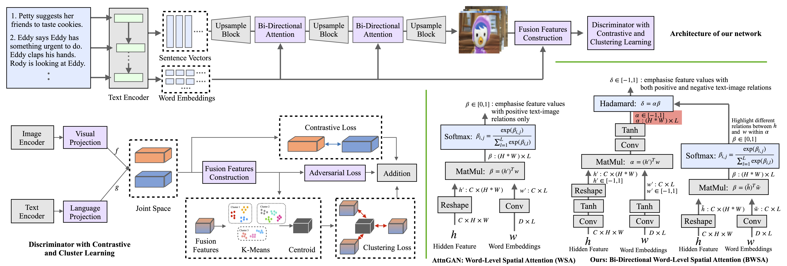

# Clustering Generative Adversarial Networks for Story Visualization
Pytorch implementation for Clustering Generative Adversarial Networks for Story Visualization. The goal is to generate a sequence of images to narrate each sentence in a multi-sentence story with a global consistency across dynamic scenes and characters.

### Overview


**[Clustering Generative Adversarial Networks for Story Visualization](https://dl.acm.org/doi/abs/10.1145/3503161.3548034).**  
[Bowen Li](https://mrlibw.github.io/), [Philip H. S. Torr](http://www.robots.ox.ac.uk/~phst/), [Thomas Lukasiewicz](http://www.cs.ox.ac.uk/people/thomas.lukasiewicz/).<br> University of Oxford, TU Wien <br> ACM MM 2022 <br>


### Data

1. Download [Pororo](https://drive.google.com/file/d/12qJb-faG196LiYovnhTUoaQK1suNAPFK/view?usp=share_link) dataset and extract the folder to `data/pororo`.
2. Download [Abstract Scenes](https://drive.google.com/file/d/1E0eOx3_pRFZvaKV9uWAA6o0opZxZ4Q1p/view?usp=share_link) dataset and extract the folder to `data/abstract`.

### Training
All code was developed and tested on CentOS 7 with Python 3.7 (Anaconda) and PyTorch 1.1.

#### Text Encoder Pretraining

- Please refer [ControlGAN](https://github.com/mrlibw/ControlGAN) for more details about pretraining the text encoder. The text encoder pretraining is based on [DAMSM](https://github.com/taoxugit/AttnGAN), which maximizes the cosine similarity between text and image pairs provided by the corresponding dataset.

#### Our Model
- Train the model for Pororo dataset:
```
python main_pororo.py --cfg cfg/pororo.yml
```
- Train the model for Abstract dataset: 
```
python main_abstract.py --cfg cfg/abstract.yml
```

`*.yml` files include configuration for training and testing. If you store the datasets in somewhere else, please modify `DATA_DIR` to point to the location.

`Note that` we evaluate our approach at the resolution 64 × 64 on Pororo and 256×256 on Abstract Scenes, as Abstract Scenes provides larger-scale ground-truth images. To work on images at the resolution 256 × 256, we repeat the same upsampling blocks in the generator and downsampling blocks in the discriminator.

#### Pretrained Text Encoder
- [Text Encoder for Pororo](https://drive.google.com/file/d/1FG8iB65hdNHUsz0v-XloYzd6AAE8mZSv/view?usp=share_link). Download and save it to `textEncoder/`.
- [Text Encoder for Abstract Scenes](https://drive.google.com/file/d/1eiAQ_44lh-zZ3LKP9P4TW9-slmJPiWdh/view?usp=share_link). Download and save it to `textEncoder/`.

#### Pretrained Our Model 
- [Pororo](https://drive.google.com/file/d/18Wvs9_W-DVDKpwinSnh1G9wi0ETwdviF/view?usp=sharing). Download and save it to `models/`.

### Evaluation
- Run the following commands to evaluate our approach on the `Pororo` and `Abstract Scenes` test dataset, including image generation of all stories in the test dataset, and calculation of both FID and FSD scores:
```
python main_pororo.py --cfg ./cfg/pororo.yml --eval_fid True
```
```
python main_abstract.py --cfg ./cfg/abstract.yml --eval_fid True
```

FID and FSD results will be saved in a `.csv` file.

- [Fréchet Inception Distance](https://github.com/mseitzer/pytorch-fid).

- [Fréchet Story Distance](https://github.com/basiclab/CPCStoryVisualization-Pytorch).

### Code Structure
- cfg: contains `*.yml` files.
- datasets: dataloader.
- main_pororo.py: the entry point for training and testing on Pororo.
- main_abstract.py: the entry point for training and testing on Abstract Scenes.
- trainer.py: creates the networks, harnesses and reports the progress of training.
- model.py: defines the architecture.
- inference.py: functions for evaluation.
- miscc/utils.py: loss functions and addtional help functions.
- miscc/config.py: creates the option list.

### Citation

If you find this useful for your research, please use the following.

```
@inproceedings{li2022clustering,
  title={Clustering generative adversarial networks for story visualization},
  author={Li, Bowen and Torr, Philip HS and Lukasiewicz, Thomas},
  booktitle={Proceedings of the 30th ACM International Conference on Multimedia},
  pages={769--778},
  year={2022}
}
```

### Acknowledgements
This code borrows from [Word Visualization](https://github.com/mrlibw/Word-Level-Story-Visualization), [StoryGAN](https://github.com/yitong91/StoryGAN), and [ControlGAN](https://github.com/mrlibw/ControlGAN) repositories. Many thanks.
